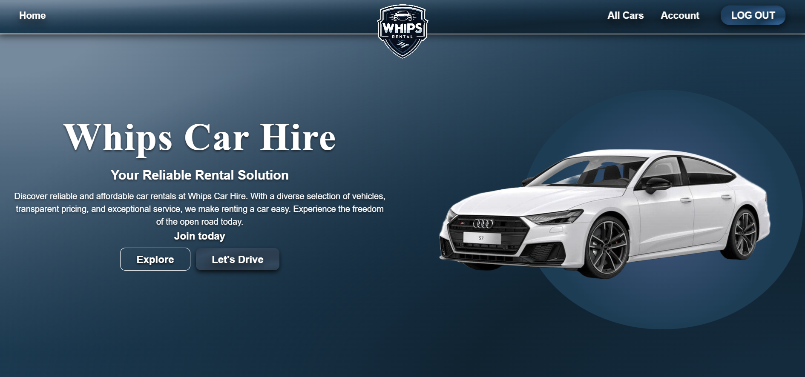
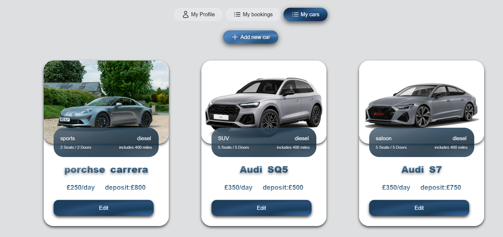
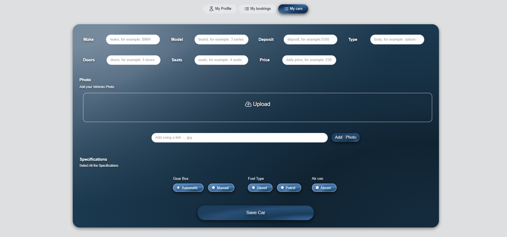
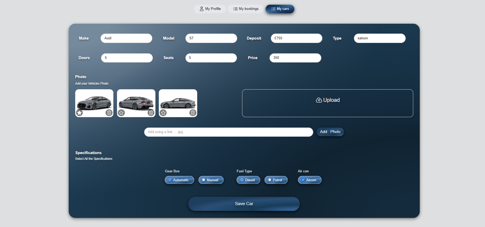
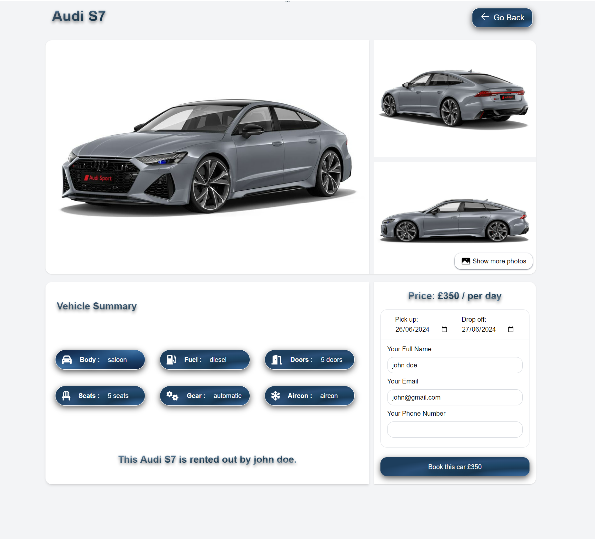

# Whips Car Rental

## Slogan

**Your Car, Your Choice. Rent and Earn with Whips Car Rental.**

## Description

Whips Car Rental is a peer-to-peer car rental service that allows users to rent a car from someone or rent out their own car to others. The platform is designed to facilitate easy and seamless car rentals, providing a platform for users to manage their car listings and bookings effortlessly.

### Core Features

1. **User Registration & Authentication**:

   - Secure user registration and login with JWT authentication.

2. **Car Management**:

   - Users can create, edit, and manage their car listings, including uploading photos and setting rental details.

3. **Booking System**:

   - Users can book cars for specified dates, with the ability to view and manage their bookings.

4. **Image Upload & Management**:

   - Users can upload images for their car listings using AWS S3 for storage.

5. **Profile Management**:
   - Users can view and edit their profiles, including personal information and rental history.

### Technologies

Whips Car Rental is built using the following technologies:

- **Frontend**:

  - React.js: For a dynamic and responsive user interface.
  - TailwindCSS: For styling.
  - Axios: For API requests.
  - React Router: For navigation.
  - AOS (Animate on Scroll): For animations.
  - Date-fns: For date management.

- **Backend**:
  - Node.js: To handle server-side operations and API requests.
  - Express.js: For creating robust server-side routes and managing the backend logic.
  - MongoDB: To store and manage data for users, cars, and bookings.
  - Mongoose: For MongoDB object modeling.
  - JWT Authentication: For secure authentication.
  - Bcryptjs: For password hashing.
  - AWS SDK: For S3 file uploads.
  - Multer: For handling file uploads.
  - Image Downloader: For downloading images.

---

## Live Demo

[Check out the live demo](https://whips-rental.vercel.app/)

---

## Table of Contents

1. [Features](#features)
2. [Screenshots](#screenshots)
3. [Installation](#installation)
4. [Usage](#usage)
5. [Support](#support)
6. [License](#license)

---

## Features

- **User Registration & Authentication**: Secure sign-up and login processes.
- **Car Management**: Create, edit, and manage car listings.
- **Booking System**: Book cars easily and manage your bookings.
- **Profile Management**: View and edit your profile and rental history.
- **Image Upload**: Upload and manage images for car listings.

## Screenshots

### Homepage



### My Cars Listing



### Create Car



### Edit Car



### Booking Page



## Installation

To get started with the Whips Car Rental app on your local machine, follow these steps:

1. **Clone the Repository**
   ```bash
   git clone https://github.com/abdinasir1warsame/whips.git
   ```
2. **Navigate to the Project Directory**

   ```bash
   cd whips-rental
   ```

3. **Install Dependencies**
   ```bash
   npm install
   ```
4. **Install Dependencies**

   ```bash
   npm start
   ```

## Usage

Once the app is set up and running, you can:

- **Sign Up**: Create a new user account.
- **Login**: Log in with your credentials.
- **Create Car Listings**: Add new cars to rent out.
- **Book Cars**: Browse and book available cars.
- **Manage Profile**: View and edit your user profile and manage your rentals.

## Support

If you encounter any issues or need support, please contact us at [abdinasir_jirde@hotmail.com](abdinasir_jirde@hotmail.com)

## License

This project is licensed under the MIT License. See the [LICENSE](LICENSE) file for details.

## Tech Stack

### Frontend:

- React.js
- TailwindCSS
- Axios
- React Router
- AOS (Animate on Scroll)
- Date-fns

### Backend:

- Node.js
- Express.js
- MongoDB
- Mongoose
- JWT Authentication
- Bcryptjs
- AWS SDK
- Multer
- Image Downloader

## Environment Variables

To run the app, set up the environment variables as outlined in the `.env.example` file. These variables include configurations for database connections and API keys for integrated services. Ensure these variables are accurately set for proper functionality.

## Deployment

The application is hosted on **Vercel**. To deploy your own version, follow the [Vercel deployment guidelines](https://vercel.com/docs) or use your preferred hosting service. Make sure that all environment variables and dependencies are correctly configured before deployment.
